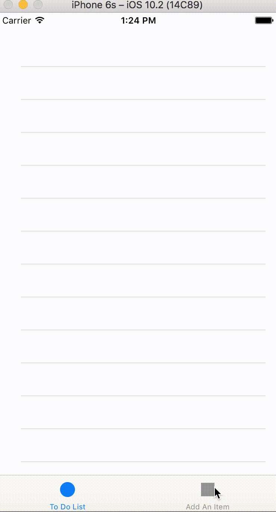

# ToDoListApp

## Background
This is one of the first swift apps I have ever built. Through making the app, I learned the basics of switching between views, displaying content on a table, deleting elements from a table, and making a more user friendly UI. The app is a basic add and remove to do list with two seperate windows, one for adding and the other for viewing/removing from the list. A demo gif can be found below

## Course
The project was taken from a Udemy Intro to App Development course. More information on the course can be found at [Udemy](https://www.udemy.com/complete-ios-10-developer-course/learn/v4/content)

## Demo

